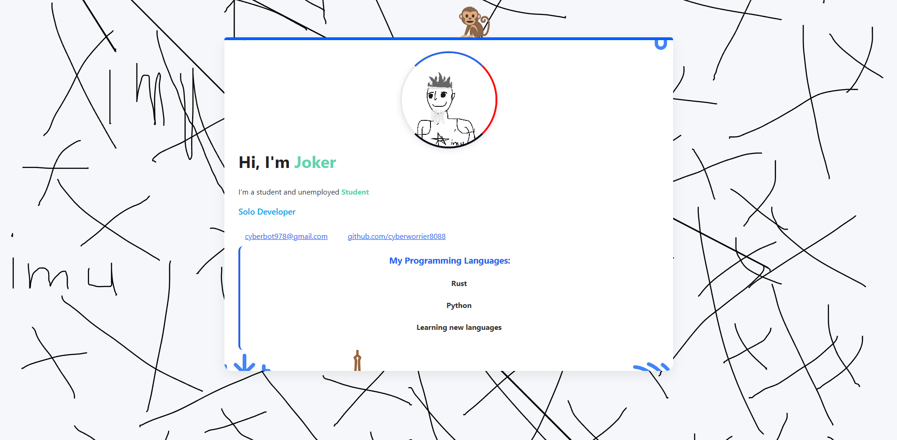

# Imu — Portfolio Website

Personal portfolio website presenting My skills and projects

🌐 Live website: [imu.com](https://cyberworrier8088.github.io/my-portfolio/)

## Overview

This repository contains the source code for my portfolio website.

The site includes:
- This project is built with HTML and CSS
- This project is my personal portfolio website
- Made meme style
- dedicated pages containner
- Responsive design
- hover effects

## Tech stack

- HTML5
- CSS3
- Vanilla JavaScript (I love vanilla ice cream)

## Repository structure

| Path | Description |
| --- | --- |
| [`index.html`](./index.html) | Main projects page |
| [`about.html`](./about.html) | About page |
| [`contact.html`](./contact.html) | Contact page |
| [`assets/`](./assets/) | Assets folder |
| [`style.css`](./style.css) | Stylesheet, this is the main file |
| [`script.js`](./script.js) | JavaScript file :)))|

## Running locally (if you don't want to use the [link](https://cyberworrier8088.github.io/my-portfolio/)

This is a static website (no build step required).

1. Clone the repository
2. Open `index.html` in your browser

## Screenshots

